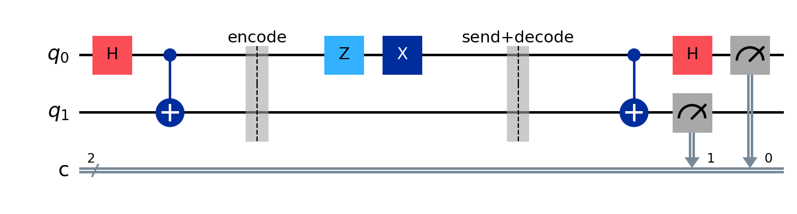

# Superdense Coding — Simulation + Physical Demo Rig

> Capstone Project — Problem Statement 4: *Simulate a superdense coding
> protocol where two classical bits are transmitted using a single qubit
> with prior entanglement.*

This project implements the superdense coding quantum protocol two ways:

1. **Software simulation** (`simulation/`) — a Qiskit implementation of
   the full protocol (Bell pair -> encode -> "send" -> Bell-basis decode),
   with automated tests proving all four 2-bit messages round-trip
   correctly, and auto-generated circuit diagrams.
2. **Physical hardware demo** (`hardware/`) — a battery-powered
   Raspberry Pi rig with two pushbuttons, two 16x2 LCDs, and status LEDs
   that lets you *physically* select a 2-bit message, press "send," and
   watch the protocol run and decode correctly in real time.

| Circuit for message `11` (gate: Z then X) |
|:---:|
|  |

## Why this is interesting

Superdense coding shows that if two parties pre-share one qubit each of
an entangled pair, one of them can later send the other **two classical
bits of information by physically transmitting only one qubit**. See
[`docs/concept/protocol-theory.md`](docs/concept/protocol-theory.md) for
the full explanation of the physics and why the protocol is guaranteed
to decode correctly every time.

## Quickstart (software simulation, no hardware needed)

```bash
python -m venv .venv && source .venv/bin/activate
pip install -r requirements.txt

# Run the protocol for all four possible 2-bit messages:
python -m simulation.demo_cli

# Run just one message, and regenerate the circuit diagrams in docs/images/:
python -m simulation.demo_cli --bits 10 --save-images

# Run the automated test suite (11 tests, verifies every message decodes correctly):
pytest simulation/tests/ -v
```

## Try the hardware rig without any hardware

The Raspberry Pi rig code runs anywhere — with no GPIO, buttons, or LCDs
attached, it automatically falls back to a keyboard-driven console demo,
so you can try the exact same code that runs on the physical build:

```bash
python -m hardware.pi_superdense_demo
# c <Enter>  = cycle Alice's message through 00 / 01 / 10 / 11
# s <Enter>  = send (runs the real Qiskit simulation and shows the result)
# q <Enter>  = quit
```

## Building the physical rig

| | |
|---|---|
| **Hardware** | Raspberry Pi 4/5, 2x pushbutton, 2x I2C 16x2 LCD, 7x LED, USB-C power bank |
| **Wiring diagram** | [`hardware/wiring/wiring_diagram.svg`](hardware/wiring/wiring_diagram.svg) |
| **GPIO pinout table** | [`docs/design/gpio-pinout.md`](docs/design/gpio-pinout.md) |
| **Bill of materials** | [`docs/design/bom.md`](docs/design/bom.md) |
| **System architecture** | [`docs/design/system-architecture.md`](docs/design/system-architecture.md) |

Once wired up (see the diagram and pinout table above):

```bash
pip install -r requirements.txt -r hardware/requirements-pi.txt
python -m hardware.pi_superdense_demo
```

Press the **CYCLE** button to pick a 2-bit message and **SEND** to run
the protocol. The Alice LCD shows the chosen bits and gate applied; the
Bob LCD shows the decoded bits and whether they matched; the LEDs show
the entanglement/transmission stage and which gate was used.

## Project structure

```
superdense-coding-project/
├── simulation/                 # Qiskit protocol implementation (the "quantum" layer)
│   ├── superdense_coding.py    #   encode / decode / run_protocol — fully unit tested
│   ├── demo_cli.py              #   terminal demo + circuit-diagram generator
│   └── tests/                   #   pytest suite (11 tests, all 4 messages verified)
├── hardware/                    # Raspberry Pi physical demo rig
│   ├── pi_superdense_demo.py    #   main GPIO/LCD event loop (falls back to keyboard mock)
│   ├── lcd_driver.py            #   I2C LCD wrapper (falls back to console mock)
│   ├── config.py                #   all GPIO pin assignments in one place
│   ├── requirements-pi.txt      #   Pi-only dependencies (gpiozero, RPLCD, smbus2)
│   └── wiring/wiring_diagram.svg
├── docs/
│   ├── concept/protocol-theory.md      # the physics: Bell states, why it works
│   ├── design/system-architecture.md   # software + hardware system design
│   ├── design/gpio-pinout.md           # full pin table
│   ├── design/bom.md                   # parts list + cost estimate
│   └── images/circuit_*.png            # auto-generated circuit diagrams
├── .github/workflows/tests.yml         # CI: runs pytest + hardware smoke test on every push
├── requirements.txt
└── LICENSE
```

## How it works, in one paragraph

Alice and Bob start by sharing one qubit each of a Bell pair. To send two
classical bits, Alice applies one of four single-qubit gates (`I`, `X`,
`Z`, or `Z` then `X`) to *only her own* qubit — this deterministically
steers the shared two-qubit state into one of four distinguishable Bell
states without Alice ever touching Bob's qubit. She then sends her
single qubit to Bob, who now holds both qubits and performs a
Bell-basis measurement (`CNOT` then `H`, then measure) to recover
Alice's original two bits with zero measurement uncertainty. This
project's `simulation/superdense_coding.py` implements exactly this
circuit in Qiskit, and `hardware/pi_superdense_demo.py` wraps it in a
physical, pressable, watchable interface.

## References

* Bennett & Wiesner, *Phys. Rev. Lett.* 69, 2881 (1992) — the original
  superdense coding proposal.
* Mattle, Weinfurter, Kwiat & Zeilinger, *Phys. Rev. Lett.* 76, 4656
  (1996) — first experimental demonstration.
* Nielsen & Chuang, *Quantum Computation and Quantum Information*,
  §2.3.

## License

[MIT](LICENSE)
