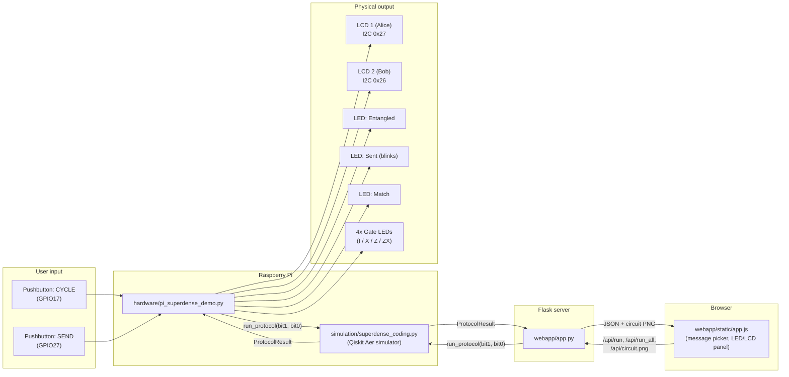

# System Architecture

This document describes how the software simulation, the physical
Raspberry Pi rig, and the web application fit together as one system.

## 1. High-level overview

## 2. Software layers

The project is deliberately layered so the *same* verified protocol logic
backs both the CLI demo and the physical rig -- the hardware never
reimplements the quantum logic, it only calls into it:

1. **`simulation/superdense_coding.py`** -- pure protocol logic. Builds
   the Qiskit circuit, runs it on `AerSimulator`, and returns a typed
   `ProtocolResult`. No I/O, no hardware dependencies. Fully unit tested.
2. **`simulation/demo_cli.py`** -- a terminal-only consumer of layer 1,
   useful for development, grading, and generating the circuit diagrams
   in `docs/images/`.
3. **`hardware/pi_superdense_demo.py`** -- a physical/interactive
   consumer of layer 1. Reads pushbuttons, calls
   `simulation.superdense_coding.run_protocol(...)`, and renders the
   `ProtocolResult` onto LCDs and LEDs.
4. **`hardware/lcd_driver.py` / `hardware/config.py`** -- hardware
   abstraction. `Lcd` transparently falls back to a console-printed
   virtual display when no real I2C LCD is present, and
   `pi_superdense_demo.py` similarly falls back to keyboard input when no
   GPIO hardware is detected (via gpiozero's mock pin factory behavior).
   This means the entire hardware layer can be developed, demoed, and
   graded on a laptop with **zero physical hardware**, then dropped onto
   an actual Raspberry Pi unchanged.
5. **`webapp/app.py`** -- a browser/interactive consumer of layer 1,
   parallel to layer 3 rather than built on top of it: a Flask app that
   calls `run_protocol(...)`/`build_superdense_circuit(...)` directly
   and returns JSON plus an on-demand circuit PNG (via
   `simulation/visualization.py`, also used by `demo_cli.py
   --save-images`). `webapp/static/app.js` re-creates the same
   idle/sending/decoded LED and LCD states as layer 3, but in the DOM
   instead of on GPIO/I2C hardware -- so the "watch it happen" part of
   the demo also works with **zero physical hardware and zero
   terminal**, from any browser.

## 3. Physical demo flow (user's point of view)

1. Power on the rig (battery pack -> Pi). Both LCDs show an idle/select
   screen; `LED_ENTANGLED` is off.
2. Press **CYCLE** to step through the four possible 2-bit messages
   (00, 01, 10, 11), shown live on the Alice LCD.
3. Press **SEND**:
   * `LED_ENTANGLED` turns on (a fresh Bell pair is conceptually
     prepared).
   * `LED_SENT` blinks for ~1.2 s to visualize the single qubit
     travelling from Alice to Bob.
   * The Pi runs the real Qiskit simulation for the selected bits.
   * Exactly one of the four gate LEDs (I / X / Z / ZX) lights up,
     showing which operation Alice applied.
   * The Bob LCD shows the decoded bits and whether they matched
     Alice's original message (`LED_MATCH`).
4. Press **CYCLE** again at any time to pick a new message and repeat.

## 4. Web demo flow (user's point of view)

The same flow, in a browser tab instead of at the physical rig:

1. Open the page. Both LCD panels show the idle/select state; all LEDs
   are off.
2. Click a message button directly, or **Cycle** to step through
   00 / 01 / 10 / 11, same as the physical CYCLE button.
3. Click **Send**:
   * `ENTANGLED` turns on and the Alice LCD panel shows "Sending...".
   * `SENT` blinks for the same `SEND_ANIMATION_SECONDS` the physical
     rig uses (`hardware/config.py`, fetched via `/api/config` so the
     two never drift apart), then the frontend calls `/api/run`.
   * The Flask route runs the real Qiskit simulation server-side and
     returns the result as JSON.
   * Exactly one gate LED (I / X / Z / ZX) lights up, the Bob LCD panel
     shows the decoded bits and `MATCH`/`MISMATCH`, and the circuit
     diagram for that exact message loads from `/api/circuit.png`.
4. **Run all 4** calls `/api/run_all` and renders a results table
   equivalent to `python -m simulation.demo_cli` with no `--bits`.

## 5. Power design

The rig is designed to run untethered from a USB power bank / battery
pack rather than a wall adapter, so it can be carried to a demo table or
judging panel:

* Raspberry Pi 4B/5 draws ~600 mA idle, up to ~1.2 A under load.
* A 10,000 mAh 5V/3A USB-C power bank comfortably runs the whole rig
  (Pi + 2 LCDs + LEDs + buttons, all low-current) for several hours.
* See `docs/design/bom.md` for the exact recommended part and current
  budget.

## 6. Why a Raspberry Pi (and not real quantum hardware)

There is no classical microcontroller or SBC that contains real qubits --
the "quantum" part of this project is always a simulation. The Pi is
chosen because it is inexpensive, runs full Python + Qiskit directly (no
cross-compilation), and has GPIO broken out for exactly this kind of
physical-computing demo. See `docs/concept/protocol-theory.md` section 5
for the distinction between "what this project simulates" and "what a
real photonic superdense coding experiment requires."
